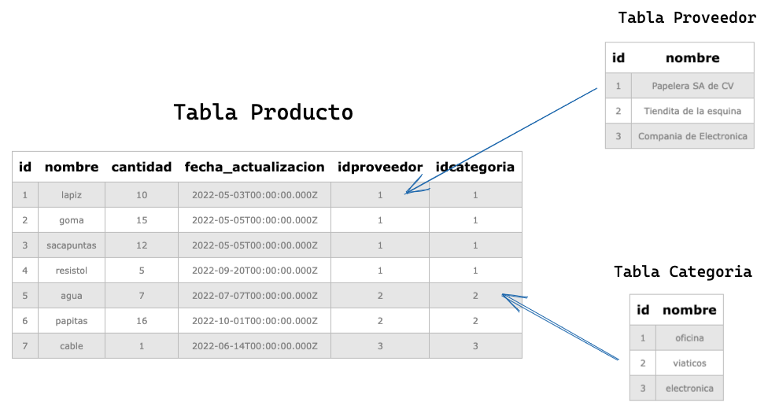
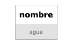
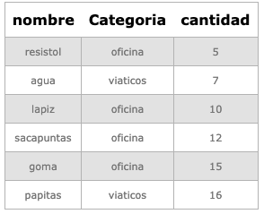
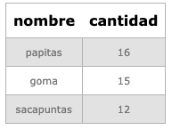

# Prueba Técnica


> Por: [Fernando Barrios](https://www.linkedin.com/in/fernando-barrios/)

### NOTAS:
* Para realizar la creación y consultas de SQL, utilicé la página https://extendsclass.com/postgresql-online.html. Por lo que, en la creación de las sentencias CREATE TABLE, en caso de provar el código en esa página, se debe escribir en una sola línea, pues se genera un error, al momento de ejecutar cada sentencia en múltiples lineas, como lo he escrito en el archivo .sql.

## Parte de SQL

### Estructura de la BD 


---
## Consultas a las tablas (Resultados)

1. Listar el nombre de los productos donde el nombre de categoria sea viaticos y la fecha de actualización del producto sea antes de septiembre.

    ``` sql 
    SELECT P.nombre
    FROM producto as P JOIN categoria as C ON P.idCategoria = C.id
    WHERE C.nombre LIKE 'viaticos' AND EXTRACT(MONTH FROM P.fecha_actualizacion) <= '09';
    ```
    

2. Listar el nombre del producto y el nombre de categoría correspondiente al producto, que tengan más de 4 en cantidad, ordenados por cantidad
    ```sql
    SELECT P.nombre, C.nombre AS "Categoria"
    FROM producto AS P INNER JOIN categoria AS C ON P.idCategoria = C.id
    WHERE P.cantidad > 4 ORDER BY P.cantidad;
    ```
    

3. Listar el nombre del proveedor donde la cantidad de productos sea mayor a 11, sin registros repetidos.

    ```sql
    SELECT DISTINCT P.nombre, P.cantidad
    FROM producto as P INNER JOIN categoria as C ON P.idCategoria = C.id
    WHERE P.cantidad > 11;
    ```
    
